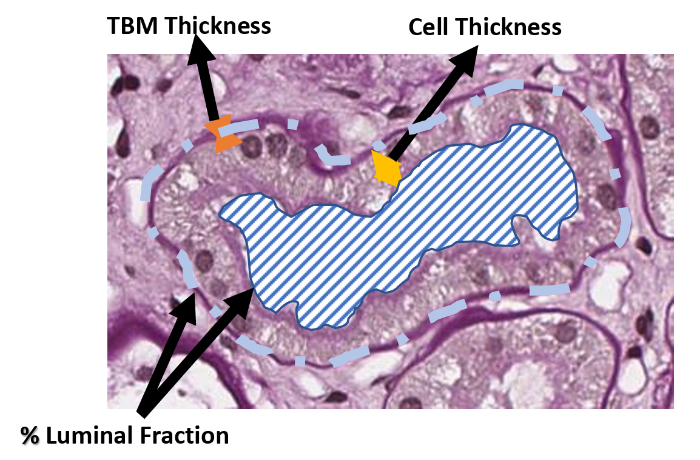
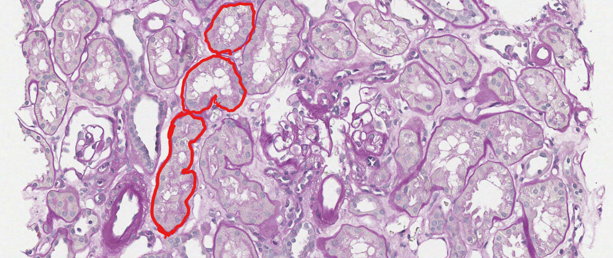

TBM_Segmentation: Segmenting Tubular Basement Membrane (TBM) in Renal Histopathology using stain deconvolution and image processing. 
----------------------------------------------------------------------------------------------------------------------






Interactive Demo: athena.rc.ufl.edu


## Abstract

TBM thickness is an important marker for tubular injury where atrophic tubules can have higher thickness. 

## Dependencies

Linux

Python 3.7

OpenCV

Tiffslide

histomicstk

girder_client

shapely

skimage


## Usage


The pipeline uses annotation from Digital Slide Archive (URL is placed in --apiUrl) in a folder with folder id in (--fid), and svsImages from --svsBase "./path/to/images/" on compute cluster for efficiency. 

The pipeline generates visualization of the extracted features and post that back to the Digital Slide Archive API to be listed as an additional annotation layer

``` shell
python 
```

## SLURM Shell Script

Please see runSlurm.sh to run using SLURM and ANACONDA Env on Compute Cluster

## Contact

Please contact me for any additional questions: ahmed.naglah@ufl.edu


